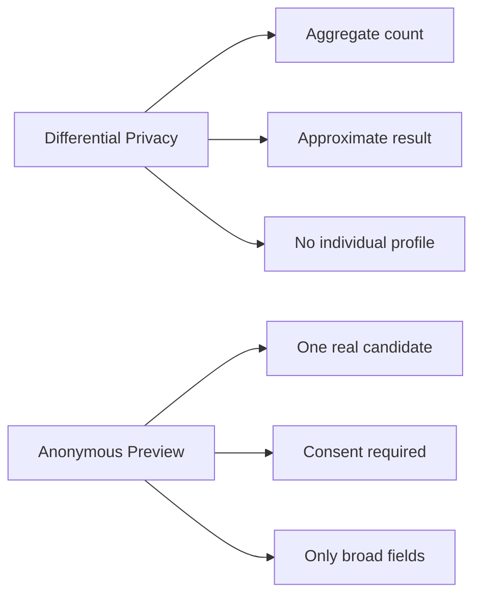

# Anonymous Candidate Preview Privacy

This feature is separate from differential privacy.

Differential privacy protects aggregate results, such as:

```text
Approximately 18 candidates have applied
```

Anonymous candidate preview shares limited information about one real candidate.

That is not the same privacy model.

## Differential Privacy Versus Anonymous Profile Sharing

| Topic | Differentially private count | Anonymous profile preview |
|---|---|---|
| Data type | Aggregate result | One real person's information |
| Output | Approximate count | Limited profile fields |
| Protection method | Controlled noise | Consent, minimization, access control |
| Can expose individual profile? | No | Yes, limited and consent-based |
| Main risk | Repeated count inference | Re-identification |



## Consent

The field is:

```java
Applicant.profileVisibleToOtherApplicants
```

Default:

```text
false
```

Recruiter visibility is separate:

```java
Applicant.profileVisibleToRecruiters
```

Setting recruiter visibility to true does not allow applicant-to-applicant preview.

## Access Control

An applicant may view anonymous previews only when:

- they are authenticated;
- they have the applicant role;
- they applied for the same job;
- the job exists;
- the preview feature is enabled;
- the target candidate opted in;
- the target candidate has an active `APPLIED` relation;
- the eligible group is large enough.

A user who merely saved the job must not access previews.

The caller cannot choose a candidate ID.

The backend selects eligible previews.

## Allowed Fields

Allowed broad fields:

- experience bucket, such as `1-3 years`;
- broad education level;
- approved skill categories;
- broad region;
- broad current role category.

Current DTO:

```java
AnonymousCandidatePreviewProfileResponse
```

Fields:

- `anonymousProfileId`;
- `experienceLevel`;
- `skillCategories`;
- `educationLevel`;
- `generalRegion`;
- `currentRoleCategory`.

## Prohibited Fields

Never expose to another applicant:

- database applicant ID;
- user ID;
- full name;
- username;
- email;
- phone number;
- exact address;
- date of birth;
- gender unless explicitly justified and consented;
- CV file URL;
- profile image;
- exact company name;
- exact university name;
- exact employment dates;
- exact application timestamp;
- certificate serial number;
- social media URL;
- portfolio URL;
- unique free-text biography;
- internal identifier.

## Skill Minimization

Exact skills can identify someone.

Example:

```text
Rust, Kubernetes, medical image segmentation, University X project
```

This combination may be unique.

So the service maps raw skills into broad categories:

- Backend;
- Frontend;
- Database;
- Cloud;
- DevOps;
- Data;
- Machine Learning;
- Mobile;
- Quality Assurance;
- Product Design;
- General Software.

## Anonymous Identifier

The preview ID must not be `applicant_id`.

The service creates a temporary scoped token using HMAC.

Scoped means it depends on:

- candidate;
- viewer;
- job;
- rotation window.

This reduces correlation across jobs and time.

## Small-Group Protection

If too few candidates opted in, previews are unavailable.

Example:

```json
{
  "available": false,
  "message": "Anonymous candidate previews are unavailable for this job.",
  "profiles": []
}
```

The response does not reveal the exact eligible count.

## Rate Limiting

The service limits preview requests per viewer, job, and window.

This reduces scraping and repeated probing.

The current implementation uses an in-memory map. For multiple backend instances, use a shared rate limiter such as Redis.

## Limitations

Anonymous preview reduces direct identification risk.

It does not make re-identification impossible.

Re-identification means connecting "anonymous" information back to a real person using outside knowledge.

Example:

If only one person in a class has 4+ years of mobile experience in Da Nang, a broad profile may still be guessed.

That is why this feature needs:

- consent;
- broad categories;
- small-group suppression;
- request limits;
- no exact fields.

## Common Mistake

Wrong statement:

```text
We added noise to one applicant profile, so the profile is differentially private.
```

Correct statement:

```text
The applicant count is differentially private. Anonymous profile preview is separate consent-based data minimization.
```

