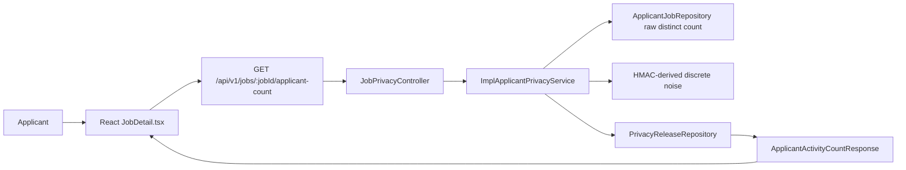
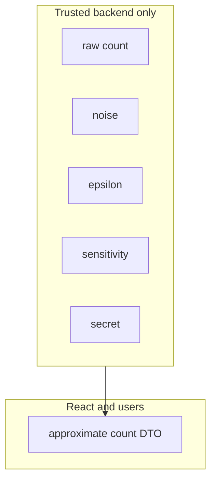

# Differential Privacy Applicant Count Implementation

This document explains how the applicant-facing approximate count works in this repository.

## Repository Map

| Mathematical or privacy concept | Real project component |
|---|---|
| Raw job | `backend/src/main/java/DATN/backend/model/Job.java` |
| Raw applicant | `backend/src/main/java/DATN/backend/model/Applicant.java` |
| Applicant-job relation | `backend/src/main/java/DATN/backend/model/ApplicantJob.java` |
| Application action | `ApplicantJob.actionType`, string value `APPLIED` |
| Raw count query | `ApplicantJobRepository.countDistinctApplicantsByJobAndActionType` |
| Privacy configuration | `PrivacyProperties` |
| Sticky release row | `PrivacyRelease` |
| Sticky release store | `PrivacyReleaseRepository` |
| Privacy service | `ImplApplicantPrivacyService` |
| Applicant-facing controller | `JobPrivacyController` |
| Safe response DTO | `ApplicantActivityCountResponse` |
| Frontend API function | `fetchApplicantActivityCount` in `jobsApi.ts` |
| Frontend UI | `JobDetail.tsx` applicant activity section |
| Tests | `BackendEndpointsIntegrationTests` |

## Endpoint

```http
GET /api/v1/jobs/{jobId}/applicant-count
Authorization: Bearer <applicant-token>
```

Safe response:

```json
{
  "message": "Applicant activity found",
  "status": 200,
  "error": null,
  "errors": null,
  "data": {
    "jobId": 123,
    "approximateApplicantCount": 18,
    "displayText": "Approximately 18 candidates have applied",
    "approximate": true
  }
}
```

The response must not include:

- `rawCount`;
- `noise`;
- `epsilonCalculation`;
- HMAC digest;
- random seed;
- secret.

## Count Semantics

The raw count is:

```sql
COUNT(DISTINCT applicant_id)
```

filtered to:

```text
actionType = "APPLIED"
```

and non-deleted relation, applicant, and job records.

This excludes:

- saved jobs;
- bookmarks;
- withdrawn applications;
- cancelled applications when represented by non-`APPLIED` action;
- deleted records;
- duplicate application rows.

The actual project currently stores action type as a string on `ApplicantJob`, not as a Java enum.

## Why Sensitivity Is 1

Sensitivity means the largest possible change caused by one person.

Because the query counts distinct applicant IDs, one applicant can add at most one to the count.

```text
Delta f = 1
```

If duplicate rows were counted, this would not be safe. One applicant could create multiple rows and change the count by more than one.

## Noise Mechanism

The service uses integer-valued discrete Laplace style noise.

```text
q = exp(-epsilon)
P(Z = k) = ((1 - q) / (1 + q)) * q^abs(k)
```

For `epsilon = 0.5`:

```text
q = exp(-0.5)
q approximately 0.6065
```

The released value is:

```text
releasedCount = max(0, rawCount + Z)
```

`Z` is the generated integer noise.

## Sticky Release

The service builds a release key:

```text
JOB_APPLICANT_COUNT|jobId={jobId}|audience=APPLICANT|window={window}
```

It first checks `privacy_releases`.

If a release already exists, it reuses it.

If no release exists, it:

1. computes the raw distinct count;
2. derives deterministic random bytes using HMAC-SHA-256;
3. samples integer noise;
4. clamps the result at zero;
5. stores the release in PostgreSQL;
6. returns only the safe DTO.

## Data Flow Diagram



## Privacy Boundary



## Class Responsibilities

### `PrivacyProperties`

Why it exists:

It binds typed privacy configuration from YAML/environment variables.

Receives:

- `epsilon`;
- release window;
- release secret;
- anonymous preview settings.

Returns:

- validated Java configuration objects.

Must never expose:

- secrets to API responses.

### `JobPrivacyController`

Why it exists:

It exposes applicant-facing privacy endpoints.

Receives:

- job ID;
- authenticated token.

Returns:

- `ApiResponse` containing safe DTOs.

Must never expose:

- entities;
- raw count;
- noise.

### `ImplApplicantPrivacyService`

Why it exists:

It owns privacy-sensitive business logic.

Receives:

- job ID;
- applicant identity from token.

Returns:

- safe approximate count DTO;
- safe anonymous preview DTO.

Must never expose or log:

- raw count;
- generated noise;
- HMAC input;
- HMAC digest;
- secret.

### `ApplicantJobRepository`

Why it exists:

It queries applicant-job relations.

Important method:

```java
countDistinctApplicantsByJobAndActionType(jobId, "APPLIED")
```

Must ensure:

- saved jobs do not count;
- withdrawn rows do not count;
- duplicate rows count once.

### `PrivacyRelease`

Why it exists:

It stores one sticky released value per release key.

Receives:

- release key;
- metric name;
- job ID;
- audience;
- release window;
- released value.

Must never store:

- raw count;
- generated noise;
- secret.

### `ApplicantActivityCountResponse`

Why it exists:

It is the applicant-facing safe DTO.

Returns only:

- job ID;
- approximate count;
- display text;
- approximate flag.

## Configuration

```yaml
privacy:
  differential:
    enabled: true
    applicant-count:
      epsilon: ${DP_APPLICANT_COUNT_EPSILON:0.5}
      release-window: ${DP_APPLICANT_COUNT_RELEASE_WINDOW:P7D}
      release-secret: ${DP_RELEASE_SECRET:local-development-dp-release-secret-change-me}
```

`epsilon`:

Selected privacy parameter. Must be greater than zero.

`release-window`:

Time period where one sticky value is reused.

`release-secret`:

Backend secret used for HMAC-derived randomness. Must be changed for production.

## Frontend Behavior

`JobDetail.tsx` calls the applicant count endpoint for logged-in applicants.

It shows:

- loading state;
- approximate count success state;
- error state with retry;
- explanatory text.

It does not:

- call exact count endpoint for applicants;
- add noise in React;
- display raw count.

## Operational Notes

- Configure `DP_RELEASE_SECRET` outside source control.
- Avoid daily releases unless the privacy budget allows it.
- Do not log raw counts or generated noise.
- If the privacy service fails, return unavailable/error, not exact count.

