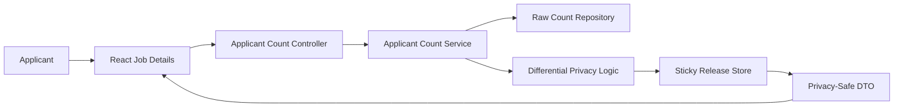
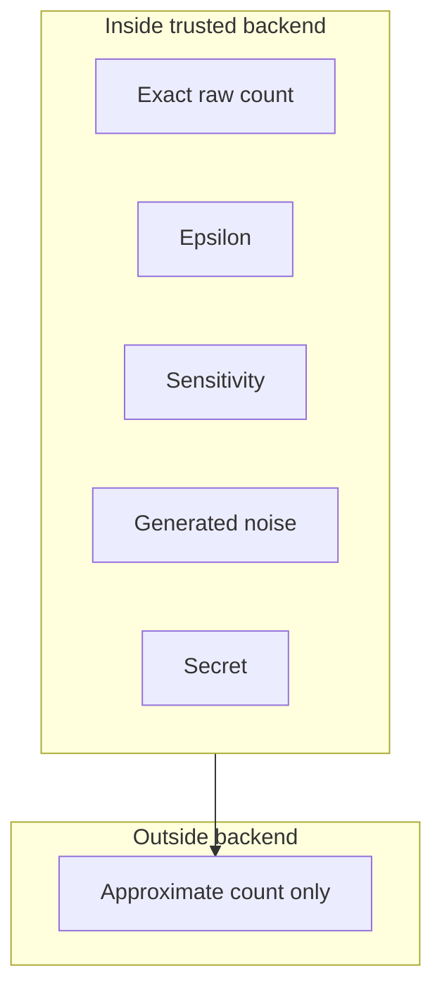

# Differential Privacy Beginner Guide

This guide starts from zero.

The example is this employment platform:

- recruiters post jobs;
- applicants apply for jobs;
- an applicant opens a job page;
- the page shows: "Approximately 18 candidates have applied."

The word "approximately" matters. It means the user does not see the exact raw number stored in the backend.

## 1. The Privacy Problem

An exact count can reveal private activity.

Example:

| Time | Exact count shown | What a viewer may infer |
|---|---:|---|
| Morning | 10 | 10 people applied |
| Afternoon | 11 | One more person applied |

Now suppose the viewer knows their friend was thinking about applying. If the count changes from 10 to 11, the viewer may guess that the friend applied.

Hiding names does not fully solve this. The count itself can still reveal that one person joined the applicant group.

Beginner checkpoint:

Question: If the site hides applicant names but still shows the exact count changing from 10 to 11, can that reveal something?

Answer: Yes. It can reveal that one additional applicant appeared.

## 2. Exact Count Leakage Example

Imagine this job:

```text
Backend Engineer
Exact applicants: 10
```

A user sees:

```text
10 candidates have applied
```

Later, the same user sees:

```text
11 candidates have applied
```

The site did not show any name. But the count changed by exactly one. If the user has outside knowledge, the change may reveal private behavior.

Controlled random noise can reduce this risk.

Random noise means a small random number added to the real count. For example:

```text
real count = 10
noise = -1
displayed count = 9
```

or:

```text
real count = 10
noise = +2
displayed count = 12
```

The displayed number is useful, but less exact.

Beginner checkpoint:

Question: If the real count is 10 and the displayed count is 12, is the frontend seeing the exact database count?

Answer: No. It is seeing a privacy-protected approximate value.

## 3. What Differential Privacy Is

### What differential privacy means

Differential privacy is a method for publishing useful results while limiting what the result reveals about one single person.

Simple version:

Differential privacy tries to make the published result look reasonably similar whether one particular person is included in the data or not.

In this platform, it protects aggregate results.

Aggregate means a combined result about many people, such as:

- total applicant count;
- grouped count by job type;
- average match score for a large group.

It does not automatically protect one real applicant profile.

Beginner checkpoint:

Question: Is "one candidate's CV" an aggregate result?

Answer: No. It is individual information about one real person.

The formal definition is:

```text
Pr[M(D) in S] <= exp(epsilon) * Pr[M(D') in S]
```

Do not worry if this looks difficult. We will translate it piece by piece.

Symbols:

- `D` means the original dataset. Example: 20 applicants applied.
- `D'` means a neighboring dataset. Example: the same data, but one applicant is removed, so 19 applicants applied.
- `M` means the mechanism. A mechanism is the algorithm that creates the published answer. In this platform, it is the code that adds privacy noise to the applicant count.
- `S` means a set of possible outputs. Example: all outputs from 17 to 20.
- `Pr` means probability. Probability means chance.
- `epsilon` is the privacy setting chosen by the system owner.
- `exp(epsilon)` means `e` raised to epsilon. `e` is about `2.71828`.

With epsilon `0.5`:

```text
exp(epsilon) = exp(0.5)
exp(0.5) is about 1.65
```

So the formula says:

```text
chance of an output with one person included
<= 1.65 * chance of that output with that person removed
```

This does not mean the count is wrong by 1.65.

It means the probabilities of outputs are controlled.

### What this formula is trying to guarantee

The formula tries to guarantee that one person's presence does not dramatically change what the system publishes.

In this platform:

If Alice applies to a job, the approximate count should not make it too easy to prove Alice applied.

If Alice does not apply, the approximate count should look reasonably similar.

Beginner checkpoint:

Question: Is the formula trying to make the count perfectly accurate?

Answer: No. It is trying to limit what the output reveals about one person.

## 4. Neighboring Datasets

A dataset is a collection of records.

Dataset `D`:

```text
20 applicants applied.
```

Dataset `D'`:

```text
The same data, except one applicant is removed.
19 applicants applied.
```

These are called neighboring datasets.

Neighboring datasets means two datasets that differ by one person's data.

Why this matters:

Differential privacy compares what the system might publish for `D` and what it might publish for `D'`.

Beginner checkpoint:

Question: If one applicant is added or removed, are the two datasets neighbors?

Answer: Yes.

## 5. Sensitivity

Sensitivity means the biggest possible change in the raw answer when one person is added or removed.

Our raw query is:

```sql
COUNT(DISTINCT applicant_id)
```

filtered to valid submitted applications for one job.

If one applicant is removed:

```text
20 becomes 19
```

The answer changes by 1.

So:

```text
Delta f = 1
```

`Delta` is the triangle-like Greek letter. Here it means "change".

`f` means the query function. In this project, `f` is "count distinct valid applicants for this job".

So `Delta f = 1` means:

```text
The count query can change by at most 1 when one applicant is added or removed.
```

The sensitivity becomes wrong if the query is wrong.

| Mistake | Why it is wrong |
|---|---|
| Count duplicate rows | One person could change the count by more than 1 |
| Count saved jobs | Saving is not applying |
| Count actions instead of applicants | One applicant may have many rows |
| Include withdrawn rows | Withdrawn application should not count as currently applied |

Beginner checkpoint:

Question: Why do we count `DISTINCT applicant_id`?

Answer: So one applicant counts once, even if duplicate rows exist.

## 6. Epsilon

Epsilon is a privacy setting.

It is often written as `epsilon`, or with the Greek letter `ε`.

In simple language:

Epsilon controls how much privacy protection the noise gives.

Important:

- epsilon is selected by the system owner;
- epsilon is not calculated from the number of applicants;
- epsilon is not a percentage;
- epsilon is not the number added to the count;
- epsilon is not the expected error;
- epsilon does not mean exactly epsilon applicants are hidden.

Smaller epsilon usually means stronger privacy and more noise.

Larger epsilon usually means weaker privacy and less noise.

| epsilon | privacy strength | expected noise behavior |
|---:|---|---|
| 0.1 | very strong | often much noisier |
| 0.5 | strong/moderate | useful demonstration default |
| 1.0 | moderate | less noisy |
| 2.0 | weaker | usually closer to exact |

No value is universally correct. Choosing epsilon is a policy decision.

It should consider:

- acceptable accuracy;
- risk level;
- release frequency;
- threat model, meaning what attackers might know or try;
- legal and organizational requirements.

Beginner checkpoint:

Question: If epsilon is `0.5`, does that mean the system adds `0.5` applicants?

Answer: No. Epsilon controls the noise distribution. It is not the noise itself.

## 7. Probability Distributions

A probability distribution describes which random values are more likely and which values are less likely.

For applicant counts, we want integer noise:

```text
..., -3, -2, -1, 0, 1, 2, 3, ...
```

Noise near zero should be more likely.

Large positive or negative noise should be possible, but less likely.

Beginner checkpoint:

Question: Should noise of `0` usually be more likely than noise of `10`?

Answer: Yes. Small noise is usually more likely.

## 8. Discrete Laplace Noise

The project uses an integer-valued discrete Laplace mechanism.

Discrete means the output values are separate integers, such as `-2`, `0`, or `3`.

Laplace here means a probability shape that gives high probability near zero and lower probability far from zero.

Formula:

```text
q = exp(-epsilon)
```

Symbols:

- `q` is a number between 0 and 1;
- `exp(x)` means `e` raised to `x`;
- `e` is about `2.71828`;
- `epsilon` is the privacy setting.

For epsilon `0.5`:

```text
q = exp(-0.5)
q = 0.6065 approximately
```

Noise probability formula:

```text
P(Z = k) = ((1 - q) / (1 + q)) * q^abs(k)
```

Symbols:

- `P(Z = k)` means "probability that the generated noise `Z` equals value `k`";
- `Z` is the generated integer noise;
- `k` is one possible noise value, such as `0`, `1`, or `-2`;
- `abs(k)` means distance from zero;
- `q^abs(k)` means `q` multiplied by itself `abs(k)` times.

With `q = 0.6065`:

First calculate the center factor:

```text
(1 - q) / (1 + q)
= (1 - 0.6065) / (1 + 0.6065)
= 0.3935 / 1.6065
= 0.245
```

Now examples:

| noise k | abs(k) | rough probability |
|---:|---:|---:|
| 0 | 0 | 0.245 |
| 1 | 1 | 0.245 * 0.6065 = 0.149 |
| -1 | 1 | 0.149 |
| 2 | 2 | 0.245 * 0.6065 * 0.6065 = 0.090 |
| -2 | 2 | 0.090 |

Positive and negative values are symmetric. That means `+2` and `-2` have the same probability.

The implementation samples this distribution from deterministic HMAC-derived bytes. HMAC is explained later.

There is another equivalent way to sample:

```text
Z = G1 - G2
```

`G1` and `G2` are geometric random variables.

A geometric random variable is a random whole number where small values are more likely and large values are less likely.

If you subtract two independent geometric values, you get positive, zero, and negative integer noise.

Independent means one random value does not control the other.

Beginner checkpoint:

Question: Is noise `-2` guaranteed when epsilon is `0.5`?

Answer: No. It is only one possible random result.

## 9. Complete Numerical Example

Given:

```text
raw applicant count = 20
sensitivity = 1
epsilon = 0.5
generated noise = -2
```

Calculate:

```text
noisyCount = rawCount + noise
noisyCount = 20 + (-2)
noisyCount = 18
```

Then post-process:

```text
displayedCount = max(0, noisyCount)
displayedCount = max(0, 18)
displayedCount = 18
```

The applicant sees:

```text
Approximately 18 candidates have applied
```

Beginner checkpoint:

Question: If the exact applicant count is 20 and the generated noise is -2, what does the user see?

Answer: 18, displayed as an approximate count.

## 10. Post-Processing

Post-processing means changing the noisy result after noise is added, without looking back at the private raw data.

We use:

```text
max(0, noisyCount)
```

This prevents negative counts.

Negative example:

```text
raw applicant count = 1
noise = -4
noisyCount = 1 + (-4)
noisyCount = -3
displayedCount = max(0, -3)
displayedCount = 0
```

A count cannot be negative.

Private values:

- raw count;
- generated noise;
- HMAC input;
- HMAC digest;
- secret.

Frontend receives only:

```json
{
  "jobId": 123,
  "approximateApplicantCount": 18,
  "displayText": "Approximately 18 candidates have applied",
  "approximate": true
}
```

Beginner checkpoint:

Question: Should the API return both `rawCount` and `approximateApplicantCount`?

Answer: No. Returning both would reveal the private count.

## 11. Sticky Noise

Sticky noise means the same privacy-protected result is reused for the same release window.

Why?

If the exact count is 20 and the system creates fresh noise on every refresh, a user might see:

```text
18, 22, 19, 21, 20, 17, 23, 20
```

If they average many numbers, they may get closer to 20.

So the same:

- job;
- metric;
- audience;
- release window;

gets the same protected value.

Beginner checkpoint:

Question: Why not create new noise on every refresh?

Answer: Repeated independent answers can be averaged to estimate the exact count.

## 12. Release Windows

A release window is a time period where the same protected value is reused.

In this project, the default is:

```yaml
release-window: P7D
```

`P7D` means a period of 7 days.

Example release key:

```text
JOB_APPLICANT_COUNT|jobId=123|audience=APPLICANT|window=epoch-window-1234
```

A release key is a label for one published privacy result.

Deterministic randomness means random-looking output that is repeatable for the same input.

HMAC means a secure keyed hash. In simple language, it is like a sealed machine:

```text
job ID + metric + week + secret key -> random-looking bytes
```

The server secret is a private string stored on the backend. It must never be sent to React.

Beginner checkpoint:

Question: If two applicants view job 123 in the same week, should they see different noisy counts?

Answer: No. They should see the same sticky protected count.

## 13. Privacy Budget

Privacy budget means a limit on how much privacy loss the system is willing to spend over time.

Composition means privacy loss can add up across multiple releases.

Simple example:

```text
one weekly release epsilon = 0.5
4 weekly releases = 4 * 0.5
total epsilon = 2.0
```

This does not mean the error is 2 applicants.

It means privacy loss can accumulate.

Daily releases spend privacy faster than monthly releases.

Sticky responses inside one window do not create a new release.

Beginner checkpoint:

Question: Does total epsilon `2.0` mean the count is wrong by exactly 2?

Answer: No. It describes accumulated privacy loss, not exact error.

## 14. Backend Architecture

Current project mapping:

| Concept | Project component |
|---|---|
| Job | `Job` entity |
| Applicant | `Applicant` entity |
| Application relation | `ApplicantJob` entity |
| Application action | `ApplicantJob.actionType` string |
| Raw distinct count | `ApplicantJobRepository.countDistinctApplicantsByJobAndActionType` |
| Privacy config | `PrivacyProperties` |
| Sticky release entity | `PrivacyRelease` |
| Sticky release repository | `PrivacyReleaseRepository` |
| Service | `ImplApplicantPrivacyService` |
| Controller | `JobPrivacyController` |
| DTO | `ApplicantActivityCountResponse` |

Data flow:



Beginner checkpoint:

Question: Which layer should keep the raw count private?

Answer: The trusted backend service.

## 15. Frontend Behavior

The React job detail page calls:

```text
GET /api/v1/jobs/{jobId}/applicant-count
```

It shows:

```text
Applicant activity
Approximately 18 candidates have applied
This count is intentionally approximate to protect applicant privacy.
```

It does not compute noise in React.

Beginner checkpoint:

Question: Should React receive the raw count and add noise itself?

Answer: No. The raw count must never leave the backend.

## 16. Security Rules

The endpoint is applicant-facing.

Rules:

- caller must be authenticated;
- caller must have applicant role;
- raw count is not serialized;
- noise is not serialized;
- secret is not serialized;
- exact count is not returned after failure.

Privacy boundary:



Beginner checkpoint:

Question: Is the frontend inside the privacy boundary?

Answer: No. The frontend only receives safe output.

## 17. Individual-Profile Limitation

Differential privacy protects aggregate outputs.

It does not automatically anonymize one real applicant profile.

If one applicant sees information about another applicant, that is individual profile sharing.

That needs:

- explicit consent;
- access control;
- data minimization;
- broad categories;
- temporary identifiers;
- small-group suppression;
- rate limiting.

Beginner checkpoint:

Question: Can we add noise to one CV and call it differentially private?

Answer: No. That is a misuse of differential privacy.

## 18. Testing

Tests should prove:

- saved jobs are excluded;
- withdrawn applications are excluded;
- duplicate rows count once;
- epsilon must be positive;
- sticky releases repeat inside the same window;
- raw count and noise are never returned;
- anonymous previews do not expose IDs or names.

Beginner checkpoint:

Question: Why test saved jobs separately?

Answer: Saving is not applying, so it must not affect the applicant count.

## 19. Common Mistakes

| Mistake | Why it is wrong |
|---|---|
| Calculating epsilon from applicant count | Epsilon is a chosen privacy setting |
| Sending raw count to React | The browser is outside the trusted backend |
| Returning raw and noisy count together | The raw count is revealed |
| Fresh noise on every refresh | Users can average repeated answers |
| Using `Math.random()` | It is not appropriate for privacy/security decisions |
| Logging raw count | Logs can leak private information |
| Exact fallback on failure | Failure must not bypass privacy |
| Calling one profile differentially private | DP protects aggregate queries, not one real profile by itself |
| Reusing full epsilon for many metrics | Privacy loss composes across releases |
| Counting saved jobs | Saved is not applied |
| Counting duplicate rows | Sensitivity assumption breaks |

Beginner checkpoint:

Question: What is the safest fallback if the privacy release fails?

Answer: Return an error or unavailable state, not the exact count.

## 20. Frequently Asked Questions

### Does approximate mean fake?

No. It is based on the real count plus controlled noise.

### Is epsilon an error percentage?

No. It controls the noise distribution.

### Why not hide the count completely?

That is possible, but the product may still want useful applicant activity. Differential privacy is a way to provide useful approximate information.

### Can recruiters still see exact applicant details?

Recruiter-only endpoints can still show full candidates if authorization, ownership, consent rules, and audit logging allow it. That is separate from applicant-facing approximate counts.

### Does sticky noise mean the value never changes?

No. It is stable inside one release window. A later window can publish a new protected value.

## 21. Short Quiz With Answers

1. Question: What does neighboring dataset mean?
   Answer: Two datasets that differ by one person's data.

2. Question: What is the sensitivity of `COUNT(DISTINCT applicant_id)` for one job?
   Answer: 1.

3. Question: Is epsilon calculated from the number of applicants?
   Answer: No.

4. Question: If raw count is 20 and noise is -2, what is displayed before clamping?
   Answer: 18.

5. Question: Why use sticky noise?
   Answer: To stop users from averaging repeated refreshes.

6. Question: Is anonymous profile sharing the same as differential privacy?
   Answer: No.
