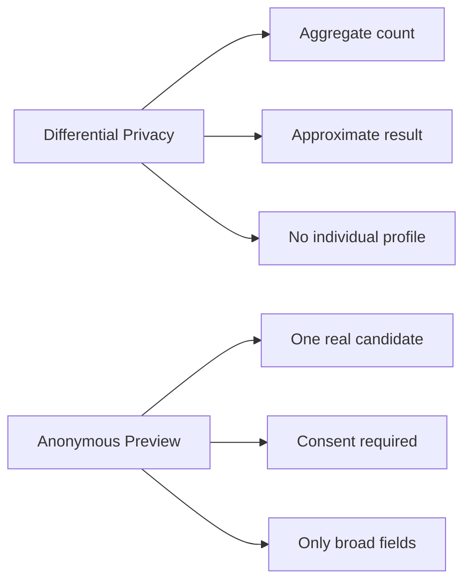

# Privacy Cho Anonymous Candidate Preview

Anonymous candidate preview là tính năng cho applicant xem một vài thông tin tổng quát về các ứng viên khác đã ứng tuyển cùng công việc.

Tính năng này tách riêng với differential privacy.

Differential privacy bảo vệ aggregate result, ví dụ:

```text
Khoảng 18 ứng viên đã ứng tuyển
```

Anonymous candidate preview chia sẻ thông tin giới hạn của một ứng viên thật. Vì vậy nó cần consent, access control và data minimization.

## 1. Khác Nhau Giữa Hai Cơ Chế

| Chủ đề | Differentially private count | Anonymous profile preview |
|---|---|---|
| Kiểu dữ liệu | Kết quả tổng hợp | Thông tin của một người thật |
| Output | Số gần đúng | Một số trường profile đã rút gọn |
| Cách bảo vệ | Thêm noise có kiểm soát | Consent, access control, giảm dữ liệu |
| Có expose profile cá nhân không | Không | Có, nhưng giới hạn |
| Rủi ro chính | Suy luận từ count lặp lại | Tái định danh |



## 2. Consent

Field cho phép applicant khác xem preview:

```java
Applicant.profileVisibleToOtherApplicants
```

Giá trị mặc định:

```text
false
```

Field visibility với recruiter là riêng:

```java
Applicant.profileVisibleToRecruiters
```

Nếu `profileVisibleToRecruiters = true`, điều đó không có nghĩa là applicant khác được xem preview.

## 3. Access Control

Một applicant chỉ được xem anonymous previews khi:

- đã đăng nhập;
- có role applicant;
- đã ứng tuyển vào cùng job;
- job tồn tại;
- feature đang enabled;
- target candidate đã opt-in;
- target candidate có relation `APPLIED` còn hiệu lực;
- nhóm eligible đủ lớn theo ngưỡng cấu hình.

Người chỉ saved job không được xem preview.

Client không được chọn candidate ID. Backend phải tự chọn eligible previews.

## 4. Trường Được Phép Trả Về

Chỉ trả về các trường rộng, khó định danh:

- experience bucket, ví dụ `1-3 years`;
- broad education level;
- approved skill categories;
- broad region;
- broad current role category.

DTO hiện tại:

```java
AnonymousCandidatePreviewProfileResponse
```

Fields được phép:

- `anonymousProfileId`;
- `experienceLevel`;
- `skillCategories`;
- `educationLevel`;
- `generalRegion`;
- `currentRoleCategory`.

## 5. Trường Cấm Trả Về

Không bao giờ expose cho applicant khác:

- database applicant ID;
- user ID;
- full name;
- username;
- email;
- phone number;
- exact address;
- date of birth;
- gender, trừ khi có lý do rõ ràng và consent riêng;
- CV file URL;
- profile image;
- exact company name;
- exact university name;
- exact employment dates;
- exact application timestamp;
- certificate serial number;
- social media URL;
- portfolio URL;
- unique free-text biography;
- internal identifier.

## 6. Skill Minimization

Exact skills có thể làm lộ danh tính nếu kết hợp với thông tin bên ngoài.

Ví dụ:

```text
Rust, Kubernetes, medical image segmentation, University X project
```

Tổ hợp này có thể chỉ có một người. Vì vậy service phải map raw skill về nhóm rộng:

- Backend;
- Frontend;
- Database;
- Cloud;
- DevOps;
- Data;
- Machine Learning;
- Mobile;
- Quality Assurance;
- Product Design;
- General Software.

Raw free-text skill không nên trả trực tiếp.

## 7. Anonymous Identifier

Preview ID không được là `applicant_id`.

Service tạo temporary scoped token bằng HMAC.

Token nên phụ thuộc vào:

- candidate;
- viewer;
- job;
- rotation window.

Cách này giảm khả năng correlate cùng một candidate qua nhiều job hoặc trong thời gian dài.

## 8. Small-Group Protection

Nếu quá ít candidate opted in, preview phải unavailable.

Ví dụ response:

```json
{
  "available": false,
  "message": "Anonymous candidate previews are unavailable for this job.",
  "profiles": []
}
```

Response không được lộ exact eligible count.

## 9. Rate Limiting

Service cần giới hạn số request preview theo viewer, job và window.

Mục tiêu:

- giảm scraping;
- giảm probing lặp lại;
- giảm khả năng suy luận bằng cách gọi API nhiều lần.

Implementation hiện tại dùng in-memory map. Nếu chạy nhiều backend instance, nên chuyển sang shared rate limiter như Redis.

## 10. Giới Hạn

Anonymous preview giảm rủi ro lộ định danh trực tiếp, nhưng không thể bảo đảm ẩn danh tuyệt đối.

Re-identification là việc gắn một profile "anonymous" với một người thật bằng cách kết hợp thông tin trong preview với kiến thức bên ngoài.

Ví dụ:

```text
Nếu chỉ có một người trong lớp có hơn 4 năm kinh nghiệm Mobile tại Đà Nẵng,
một preview tổng quát vẫn có thể bị đoán ra.
```

Vì vậy tính năng này cần:

- consent rõ ràng;
- broad categories;
- small-group suppression;
- request limits;
- không trả exact fields;
- rotate anonymous identifier.

## 11. Câu Nội Dung Nên Dùng

Sai:

```text
Chúng ta thêm noise vào một applicant profile, nên profile đó là differentially private.
```

Đúng:

```text
Applicant count là differential privacy. Anonymous profile preview là consent-based data minimization riêng.
```

## 12. Checklist Khi Sửa Code

Kiểm tra:

- default opt-in là `false`;
- recruiter visibility không cấp quyền applicant visibility;
- saved-job user bị từ chối;
- target candidate phải có `APPLIED` active;
- response không có direct identifier;
- raw skill được map về category rộng;
- anonymous ID không phải database ID;
- small group không lộ exact eligible count;
- rate limit hoạt động;
- test privacy liên quan đã pass.
