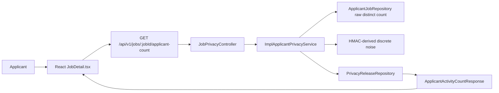
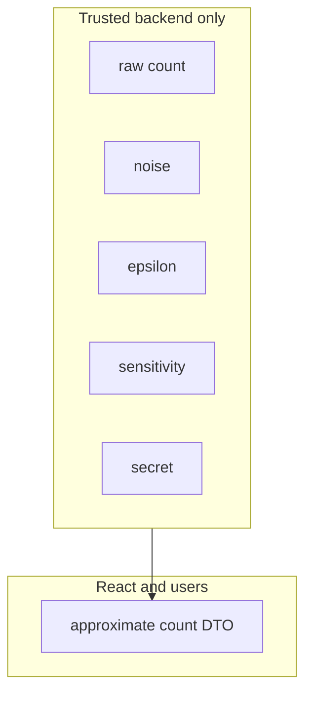

# Triển Khai Differential Privacy Cho Applicant Count

Tài liệu này mô tả cách endpoint applicant-facing approximate count hoạt động trong repository.

## 1. Bản Đồ Thành Phần Trong Project

| Khái niệm privacy/kỹ thuật | Thành phần trong project |
|---|---|
| Job gốc | `backend/src/main/java/DATN/backend/model/Job.java` |
| Applicant gốc | `backend/src/main/java/DATN/backend/model/Applicant.java` |
| Quan hệ applicant-job | `backend/src/main/java/DATN/backend/model/ApplicantJob.java` |
| Hành động ứng tuyển | `ApplicantJob.actionType`, giá trị string `APPLIED` |
| Raw count query | `ApplicantJobRepository.countDistinctApplicantsByJobAndActionType` |
| Cấu hình privacy | `PrivacyProperties` |
| Sticky release row | `PrivacyRelease` |
| Nơi lưu sticky release | `PrivacyReleaseRepository` |
| Privacy service | `ImplApplicantPrivacyService` |
| Controller applicant-facing | `JobPrivacyController` |
| DTO response an toàn | `ApplicantActivityCountResponse` |
| Frontend API function | `fetchApplicantActivityCount` trong `jobsApi.ts` |
| Frontend UI | Applicant activity section trong `JobDetail.tsx` |
| Tests | `BackendEndpointsIntegrationTests` |

## 2. Endpoint

```http
GET /api/v1/jobs/{jobId}/applicant-count
Authorization: Bearer <applicant-token>
```

Response an toàn:

```json
{
  "message": "Applicant activity found",
  "status": 200,
  "error": null,
  "errors": null,
  "data": {
    "jobId": 123,
    "approximateApplicantCount": 18,
    "displayText": "Approximately 18 candidates have applied",
    "approximate": true
  }
}
```

Response không được có:

- `rawCount`;
- `noise`;
- `epsilonCalculation`;
- HMAC digest;
- random seed;
- secret.

## 3. Count Semantics

Raw count:

```sql
COUNT(DISTINCT applicant_id)
```

Điều kiện:

```text
actionType = "APPLIED"
```

và relation, applicant, job đều không bị delete.

Query này phải loại trừ:

- saved jobs;
- bookmarks;
- withdrawn applications;
- cancelled applications nếu biểu diễn bằng action khác `APPLIED`;
- deleted records;
- duplicate application rows.

Project hiện lưu action type dạng string trong `ApplicantJob`, không phải Java enum.

## 4. Vì Sao Sensitivity Là 1

Sensitivity là mức thay đổi lớn nhất của câu trả lời thật khi thêm hoặc bớt một người.

Vì query đếm distinct applicant ID, một applicant chỉ có thể làm count tăng hoặc giảm tối đa 1:

```text
Delta f = 1
```

Nếu duplicate rows bị đếm nhiều lần, giả định này sẽ sai và privacy guarantee không còn đúng.

## 5. Noise Mechanism

Service dùng integer-valued discrete Laplace style noise.

```text
q = exp(-epsilon)
P(Z = k) = ((1 - q) / (1 + q)) * q^abs(k)
```

Với `epsilon = 0.5`:

```text
q = exp(-0.5)
q xấp xỉ 0.6065
```

Giá trị released:

```text
releasedCount = max(0, rawCount + Z)
```

`Z` là integer noise được sinh ra trong backend.

## 6. Sticky Release Flow

Service tạo release key:

```text
JOB_APPLICANT_COUNT|jobId={jobId}|audience=APPLICANT|window={window}
```

Flow:

1. Kiểm tra `privacy_releases`.
2. Nếu release đã tồn tại, tái sử dụng giá trị đã lưu.
3. Nếu chưa có release, tính raw distinct count.
4. Tạo deterministic random bytes bằng HMAC-SHA-256.
5. Sample integer noise.
6. Clamp kết quả về tối thiểu 0.
7. Lưu released value vào PostgreSQL.
8. Trả về DTO an toàn.

Bảng `PrivacyRelease` chỉ nên lưu giá trị đã công bố, không lưu raw count hoặc noise.

## 7. Data Flow



## 8. Privacy Boundary



Chỉ backend được thấy raw count, noise, epsilon internals và secret. React chỉ nhận DTO đã bảo vệ.

## 9. Trách Nhiệm Các Class

### `PrivacyProperties`

Dùng để bind cấu hình privacy từ YAML/environment variables.

Nhận:

- `epsilon`;
- release window;
- release secret;
- anonymous preview settings.

Không được expose secret ra API response.

### `JobPrivacyController`

Dùng để expose privacy endpoint cho applicant.

Nhận:

- job ID;
- authenticated token.

Trả:

- `ApiResponse` chứa safe DTO.

Không được trả entity, raw count hoặc noise.

### `ImplApplicantPrivacyService`

Dùng để chứa business logic nhạy cảm về privacy.

Nhận:

- job ID;
- applicant identity từ token.

Trả:

- approximate count DTO;
- anonymous preview DTO nếu endpoint liên quan.

Không được expose hoặc log:

- raw count;
- generated noise;
- HMAC input;
- HMAC digest;
- secret.

### `ApplicantJobRepository`

Dùng để query quan hệ applicant-job.

Method quan trọng:

```java
countDistinctApplicantsByJobAndActionType(jobId, "APPLIED")
```

Cần đảm bảo:

- saved jobs không được đếm;
- withdrawn rows không được đếm;
- duplicate rows chỉ tính một lần.

### `PrivacyRelease`

Dùng để lưu một sticky released value theo release key.

Nên lưu:

- release key;
- metric name;
- job ID;
- audience;
- release window;
- released value.

Không được lưu:

- raw count;
- generated noise;
- secret.

### `ApplicantActivityCountResponse`

DTO an toàn cho frontend.

Được phép có:

- `jobId`;
- `approximateApplicantCount`;
- `displayText`;
- `approximate`.

Không được có:

- raw count;
- noise;
- debug calculation;
- secret-related values.

## 10. Lỗi Cần Tránh

Sai:

```text
Nếu privacy service lỗi, trả raw count cho frontend.
```

Đúng:

```text
Trả error hoặc unavailable state.
```

Sai:

```text
Gửi raw count về React rồi React cộng noise.
```

Đúng:

```text
Backend cộng noise và chỉ trả approximate count.
```

Sai:

```text
Lưu raw count và noise trong privacy_releases để debug.
```

Đúng:

```text
Chỉ lưu released value và metadata cần thiết.
```

## 11. Checklist Khi Sửa Code

Trước khi merge, kiểm tra:

- raw count query dùng `COUNT(DISTINCT applicant_id)`;
- chỉ đếm `APPLIED`;
- saved/withdrawn/deleted/duplicate không làm sai count;
- `epsilon > 0`;
- release key không phụ thuộc vào viewer với aggregate count;
- sticky release được persist;
- response không có raw count/noise/secret;
- frontend hiển thị label approximate;
- test backend liên quan đã pass.
