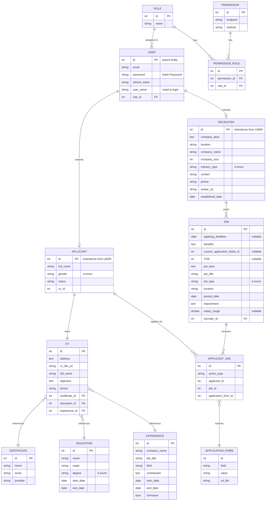

Here's the complete Mermaid ER diagram code

**Notation reference for the cardinality symbols used:**
- `||--o|` → One-to-One (optional on one side)
- `||--o{` → One-to-Many
- `}o--||` → Many-to-One
- `}o--o{` → Many-to-Many (used implicitly via bridge tables like `PERMISSION_ROLE` and `APPLICANT_JOB`)

One thing to double check when you paste this in: some editors are strict about the `|o`, `||`, `o{`, `}o` syntax spacing — make sure there's no extra space between the pipes/braces and the dashes, or the parser will throw a syntax error.